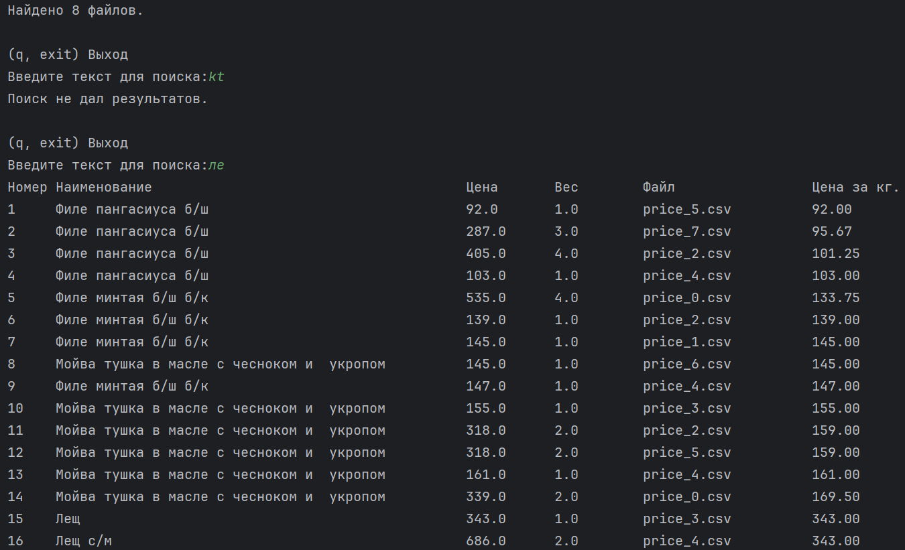

# Price List Analyzer

* Предоставить интерфейс для поиска товара по фрагменту названия с сортировкой по цене за килограмм.
* Предусмотреть вывод массива данных в текстовый файл в формате html.



### Создан класс с методами:
+ load_prices - загружает данные.
+ export_to_html - выгружает все данные в html файл.
# 🛠️ **Установка и настройка**
### *Клонируем проект*
* Скачать проект в PyCharm(е):
    * Кнопка создания проекта "from Version Control"
        * Вкладка Repository URL > URL > `https://github.com/***.git`
    * ИЛИ через терминал:
        * `git clone https://github.com/Volfram007/Price-List-Analyzer.git`
    * Создание папки виртуального окружения
        * `python -m venv venv`
    * Активация папки:
        ```bash 
        .\venv\Scripts\activate
        ```